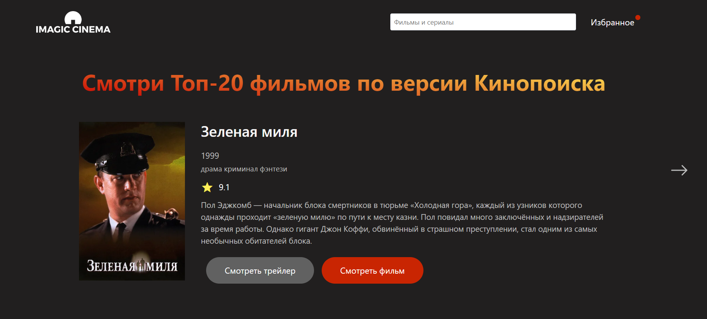
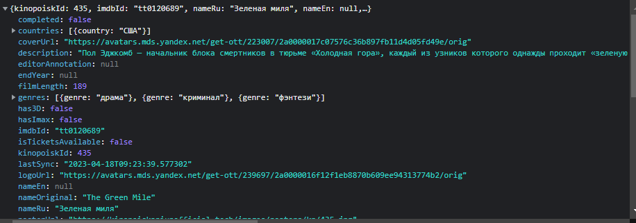
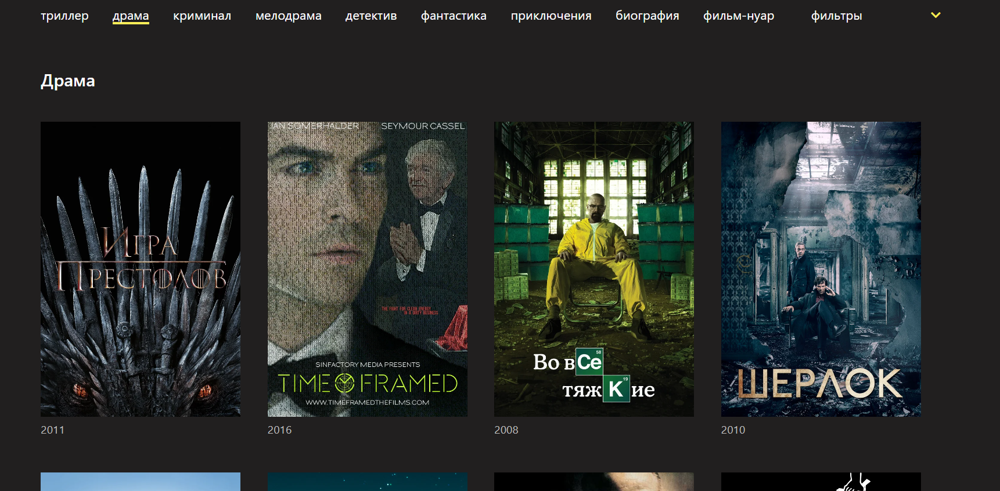
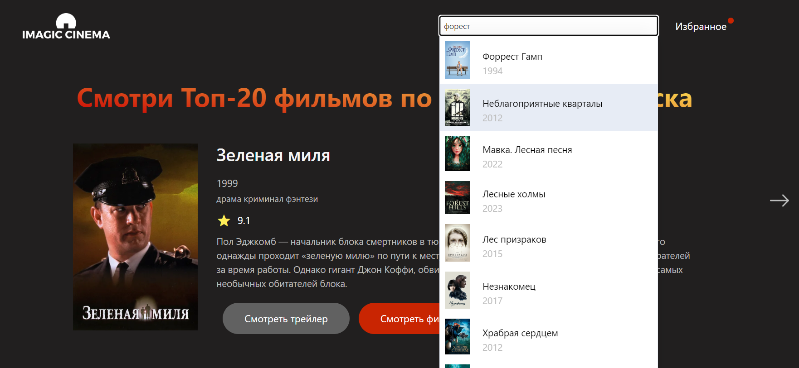
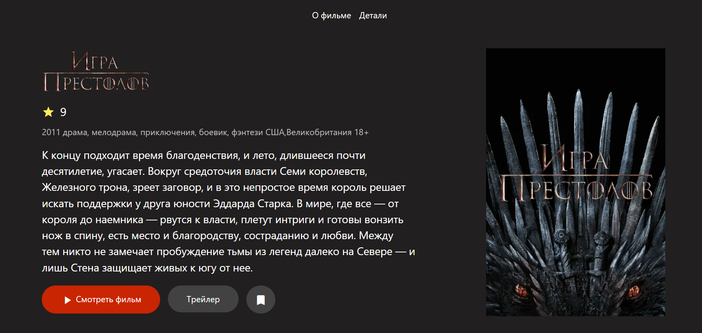
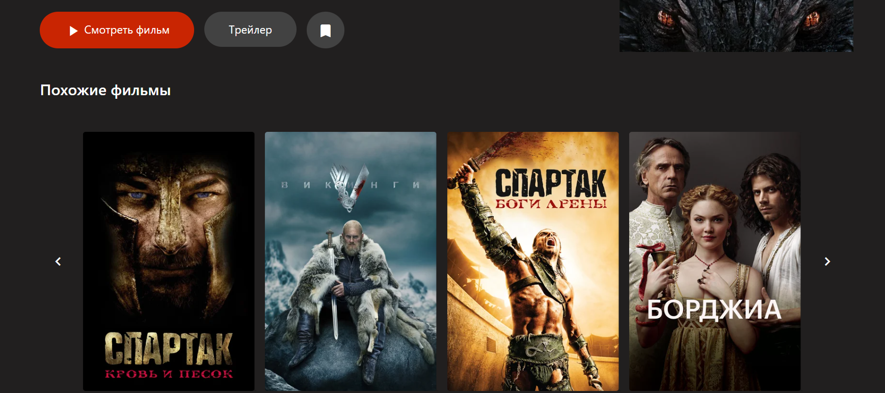
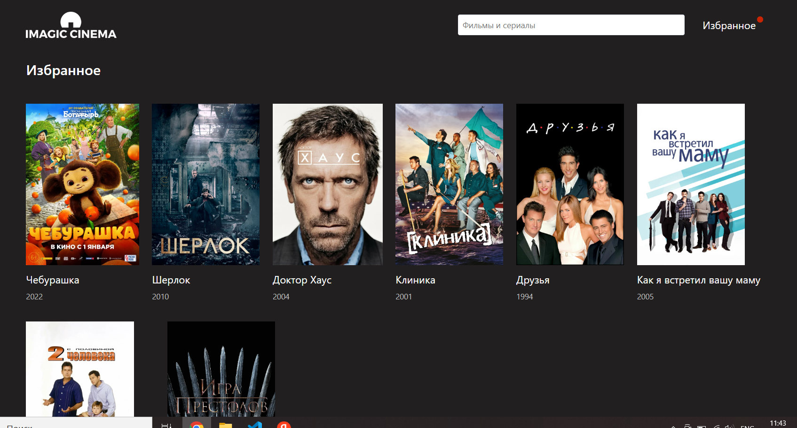
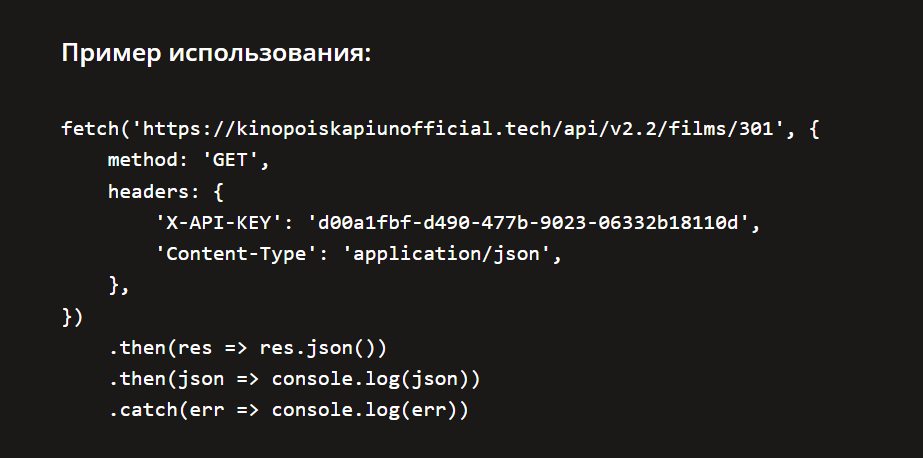

# Movies app demo built using Nuxt 2

This project built on Nuxt 2. Also I used **Vuetify** in few components and **Kinopoisk Api Unofficial** to access up-to-date Kinopoisk's information.

### Motivation

I decided to make this project for educational purposes while studying Nuxt 2.

### TODO

✔️ Slider "Top-20 films according to Kinopoisk". Designed with CSS only.



The response from the server provides an object with information about the movie


✔️ The ability to filter movies by genre.



✔️ Search movies by title.



✔️ Film detail page with selection of similar films. On this page user can add film to favorites or watch film's trailer.




✔️Featured movies page.



### API Reference

[Kinopoisk Api Unofficial](https://kinopoiskapiunofficial.tech/)

Example


## Build Setup

```bash
# install dependencies
$ npm install

# serve with hot reload at localhost:3000
$ npm run dev

# build for production and launch server
$ npm run build
$ npm run start

# generate static project
$ npm run generate
```
